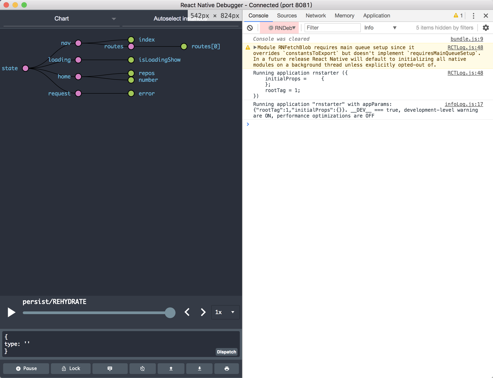

## 1. 技术栈

**1.1 javascript - [ECMAScript6](http://es6.ruanyifeng.com/#docs/object) :** 语言工具; 

**1.2 React :** 起源于 Facebook 的内部项目, 因为该公司对市场上所有 JavaScript MVC 框架，都不满意，就决定自己写一套，用来架设 Instagram 的网站。做出来以后，发现这套东西很好用，在2013年5月开源. 由于 React 的设计思想极其独特，属于革命性创新，性能出众，代码逻辑却非常简单。所以，越来越多的人开始关注和使用，认为它可能是将来 Web 开发的主流工具;

**1.3 [flex 布局](https://reactnative.cn/docs/0.51/layout-with-flexbox.html#content) :**  网页应用的主流布局方式;

**[ReactNative](https://reactnative.cn/) :** facebook开发的跨平台工具，基于React，结果一天之内，就获得了 5000 颗星，受瞩目程度可见一斑， 截止到文章日期5.6K星;

**1.4 Node.js & npm & Yarn :** 了解基础 & 使用

**1.5 [redux](http://cn.redux.js.org/index.html) :** JS 状态容器，实现view & state 分离，开发体验超爽， 而且体小精悍(只有2K)

**1.6 [immutable.js](https://facebook.github.io/immutable-js/) :**  
[Pete Hunt](https://github.com/petehunt): Shared mutable state is the root of all evil（共享的可变状态是万恶之源）, 有人说 Immutable 可以给 React 应用带来数十倍的提升，也有人说 Immutable 的引入是近期 JavaScript 中伟大的发明, Facebook 工程师 Lee Byron 花费 3 年时间打造，与 React 同期出现。    
[Immutable 详解及 React 中实践](https://github.com/camsong/blog/issues/3)

## 2. 开发链路

### 2.1 环境安装

react-native [环境安装](https://reactnative.cn/docs/0.51/getting-started.html)

### 2.2 调试 

调试：开发流程中最重要的事情，下面两个工具给RN开发带来了超爽的体验
RN 调试工具：[react-native-debugger](https://github.com/jhen0409/react-native-debugger)   
redux 开发扩展插件：[redux-devtools-extension](https://github.com/zalmoxisus/redux-devtools-extension)



### 2.3 eslint 

javascript是解释型语言，编译过程只有词法分析和语法分析，并没有词法检查. eslint对于js的意义格外重要  
* 避免隐藏错误  
* 代码统一规范，提高可读性  
	
[eslint](https://eslint.org/) 		
[babel-eslint](https://github.com/babel/babel-eslint)	
[eslint-plugin-react](https://github.com/yannickcr/eslint-plugin-react)


### 2.4 UT : 代码质量的保证

[redux unit test](https://redux.js.org/docs/recipes/WritingTests.html).对于actions & reduce校验不可少.    
[Jest](https://facebook.github.io/jest/docs/en/tutorial-react-native.html) 很棒的BDD。（PS：每当发现一个工具特别好用的时候，发现都是facebook开源的）。  
[fetch-mock](http://www.wheresrhys.co.uk/fetch-mock/). 异步单测不可少.  

### 2.5 CI

[travis-ci](https://travis-ci.org/). github最流行的CI工具之一.   
[circle-ci](https://circleci.com/) react-native github库使用的CI工具.   
[gitlab-ci](https://about.gitlab.com/features/gitlab-ci-cd/) 有条件买gitlab的，可以试试这个

### 2.6 UI组件以及相关API：

成功搭建环境以后，可以写一个hello world[体验一下](https://reactnative.cn/docs/0.51/tutorial.html#content), react-native[文档](https://reactnative.cn)上对开放的组件以及相关API有详细的介绍和DEMO

### 2.7 转场：流畅的转场动画对于APP体验很重要 

[react-navigation](https://reactnavigation.org/docs/intro/). RN社区今后主推的方案是一个单独的导航库react-navigation，它的使用十分简单。    
性能上： 在原生线程上的Animated动画库，因而性能表现十分流畅。此外其动画形式和手势都非常便于定制.     
使用上：路由栈可以集成到redux中管理, 超级爽的体验

### 2.8 状态： [redux](http://cn.redux.js.org/)

view 与 状态分离

Redux 由 Flux 演变而来，但受 Elm 的启发，避开了 Flux 的复杂性。 不管你有没有使用过它们，只需几分钟就能上手 Redux。

单向数据流：
应用中所有的 state 都以一个对象树的形式储存在一个单一的 store 中。 惟一改变 state 的办法是触发 action，一个描述发生什么的对象。 为了描述 action 如何改变 state 树，你需要编写 reducers。

### 2.9 网络：    

[fetch](https://reactnative.cn/docs/0.51/network.html#content)  
[更好数据传输工具](https://github.com/wkh237/react-native-fetch-blob)

### 2.10 存储： 

[AsyncStorage](https://reactnative.cn/docs/0.51/asyncstorage.html#content)     
[集成redux存储](https://github.com/rt2zz/redux-persist)

### 2.11 APP交互: 

toast 和 loading对于APP交互时一个重要体验，不要让用户以为你死机了 

[toast](https://github.com/crazycodeboy/react-native-easy-toast)  	    	
[react-native-spinkit](https://github.com/maxs15/react-native-spinkit) 集成了很多loading动画

### 2.12 热更新： 

React Native一个重要功能，支持热更新，苹果去年有过一次对热修复的严打，JSPatch惨遭扼杀，不过对于RN这样的沙盒热更新是可以的

[官方热更新](http://update.reactnative.cn/) 

有条件的单位可以自己建热修复服务，下载bundle包

### 2.13 [丰富的组件库](https://react.parts/?collection=React+Native)

## 3. [rnstart](https://github.com/jeremyzj/rnstarter)是针对上面总结的RN starter demo工程

### 3.1 目录结构

```
 |-- rnstarter
    |-- __tests__    				//单测文件目录
    |-- android						//安卓平台    
    |-- ios							//iOS平台
    |-- README.md
    |-- fastlane				   	//fastlane iOS打包工具
    |-- package.json
    |-- .babelrc		
    |-- .eslintrc.js				//eslint配置文件
    |-- .gitignore
    |-- .travis.yml					//travis ci 配置文件
    |-- index.js					//APP 入口文件
    |-- App
        |-- Component				//无状态组件
        |-- Image					//图片资源
        |-- Modules					//业务状态模块，管理redux的actions, reducer
        |-- Navigation				//转场, route管理
        |-- Network					//网络
        |-- Middleware				//redux 中间件
        |-- Theme					//全局主题管理
        	  |-- colors.js
        	  |-- Fonts.js
        	  |-- index.js
        	  |-- Sizes.js
        	  |-- Styles.js
        |-- Util						//工具类
        |-- ConfigureStore.js			//redux store配置
        |-- index.js				//入口文件
        |-- Reducers.js				//reducers
```


### 3.2 安装

```
git clone https://github.com/jeremyzj/rnstarter
cd rnstarter & npm install

```

建议先安装react-native-debugger 体验效果会更好

### 3.3 运行

```
react-native run-ios //或者react-native run-andriod
```


 


